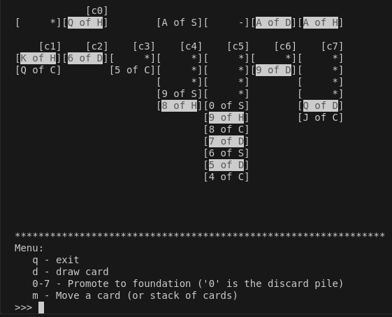
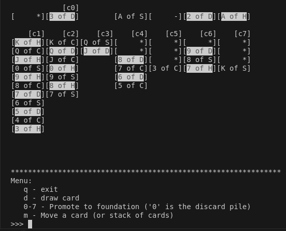
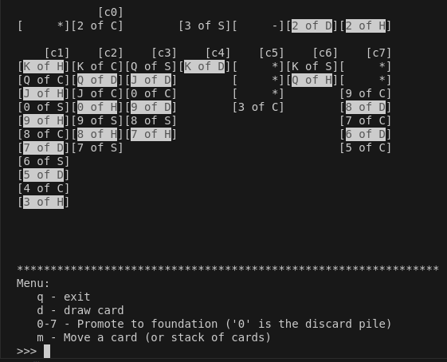
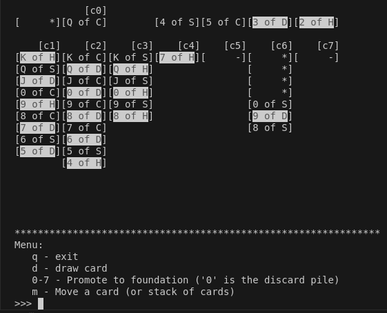
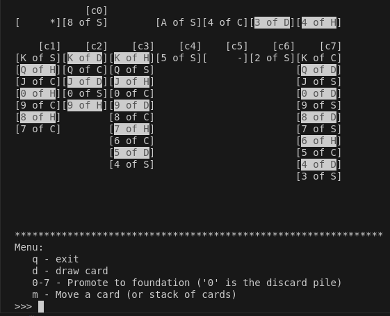
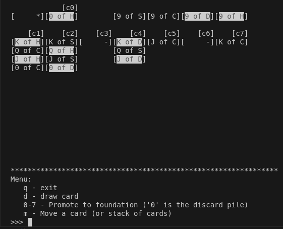
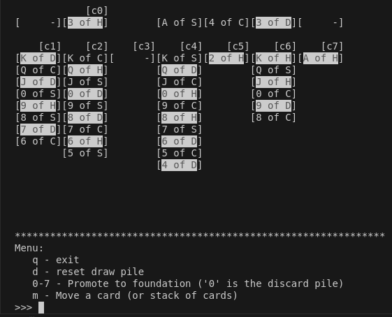
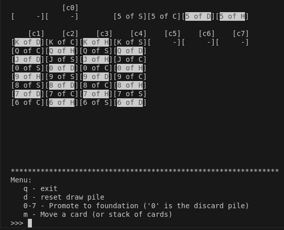

# Solitaire

## How to run

- `make`

or

1. `g++ -std=c++23 -o solitaire src/*.cpp`
2. `./solitaire`

## Controls

- `q` - Exit
- `d` - Draw a card; also, resets the draw pile when it runs out
- `0` - `7`
  - `0` - Promote the current card from the discard pile to the foundations
  - `1` - `7` - Promote the bottom-most card on the labelled column to the foundations
- `m` - Move a card or stack of cards
  - Specify a card to move from the discard pile (`0`) to a column (`1` - `7`)
  - Specify to move a stack of cards from one column (`1` - `7`) to another (`1` - `7`)

## TODO

- Does not have a scoring system
- Does not support moving "sub-columns" of cards (ie. column moves are all or nothing)
- Would be cool to `tee` out to keep logs of played games :)
  - (Color on the terminal also gets `tee`'ed out)
- Support curses so that we don't have to hit enter after every command?

